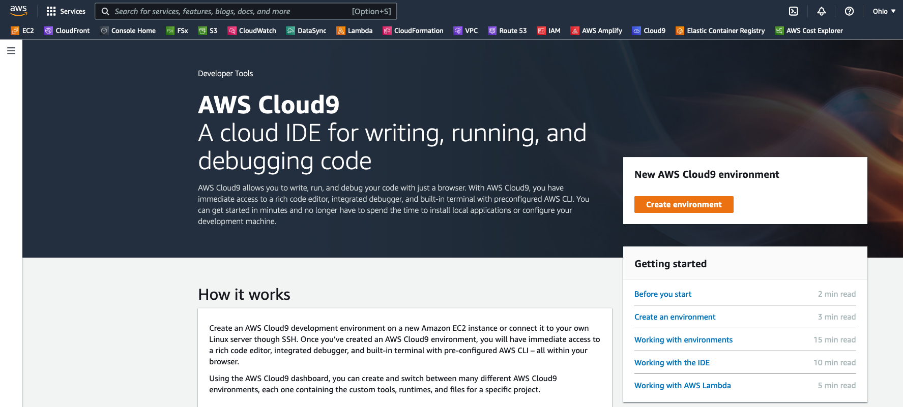
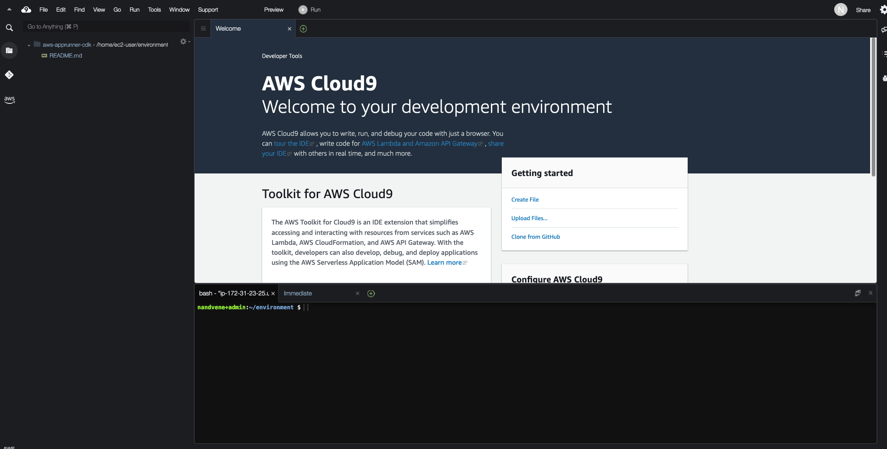
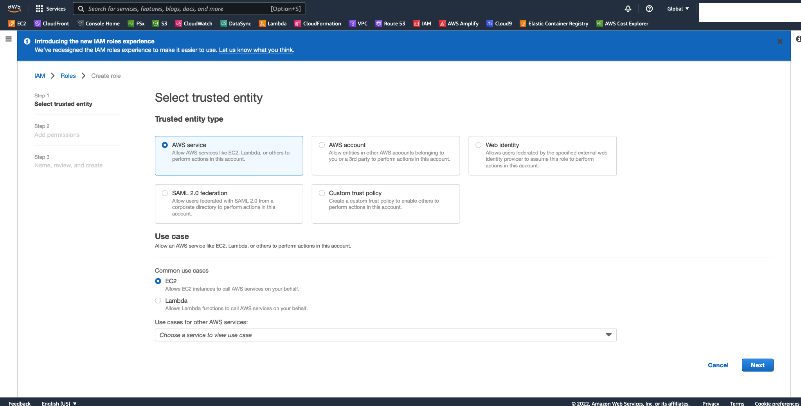
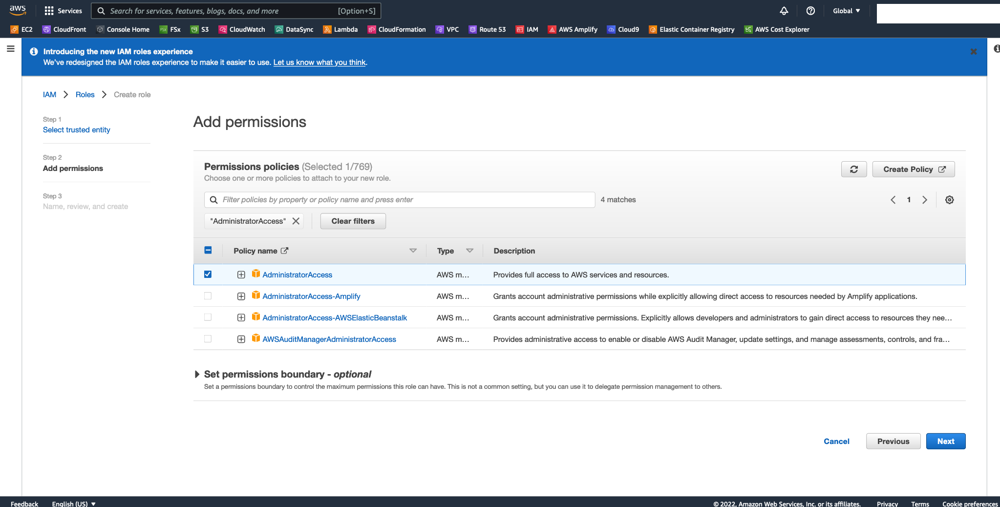
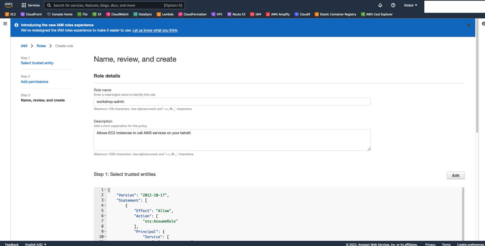
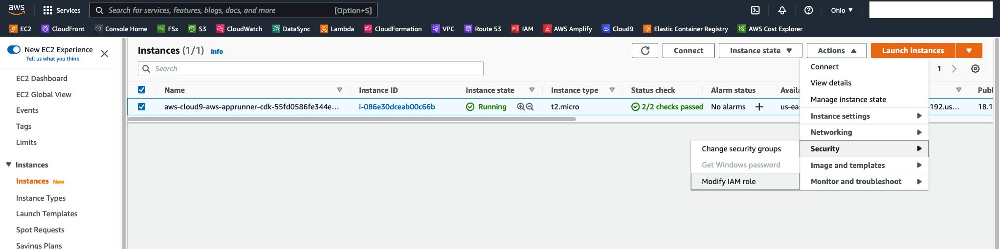
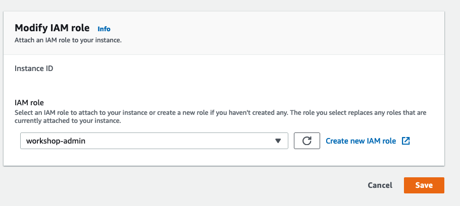
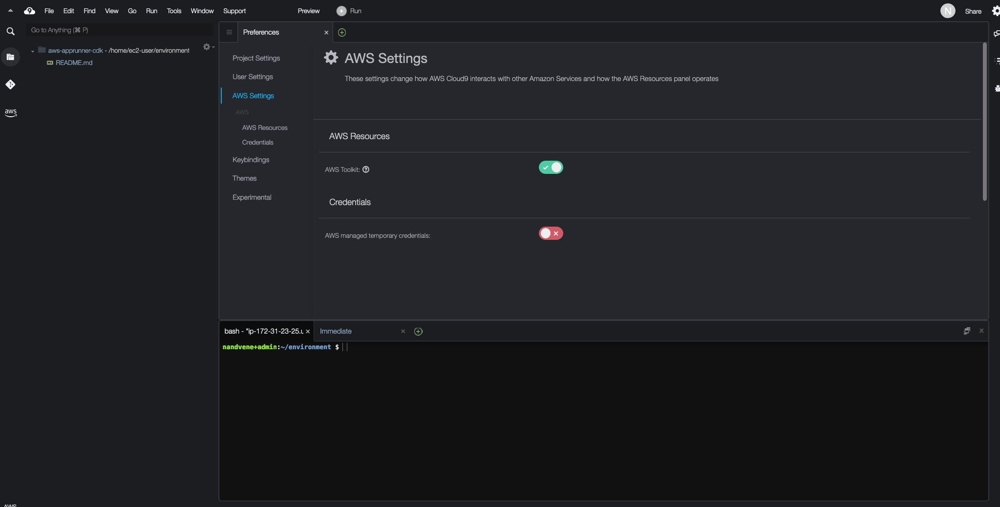

### AWS account

Ensure you have access to an AWS account, and a set of credentials with *Administrator* permissions. **Note:** In a production environment we would recommend locking permissions down to the bare minimum needed to operate the pipeline.

### Create an AWS Cloud9 environment

Log into the AWS Management Console and search for Cloud9 services in the search bar. Click Cloud9 and create an AWS Cloud9 environment in the `us-east-2` region based on Amazon Linux 2. You can provide a environment name of `workshop-environment` for name and select the instance type as **t2.micro** or **t3.micro**.


### Configure the AWS Cloud9 environment

Launch the AWS Cloud9 IDE. Close the `Welcome` tab and open a new `Terminal` tab.



#### Create and attach an IAM role for your Cloud9 instance

Disable Cloud9 temporary credentials, and create and attach an IAM role for your Cloud9 instance so that you can deploy using AWS CDK for initial setup.

1. Follow [this deep link to create an IAM role with Administrator access.](https://console.aws.amazon.com/iam/home#/roles$new?step=review&commonUseCase=EC2%2BEC2&selectedUseCase=EC2&policies=arn:aws:iam::aws:policy%2FAdministratorAccess)
2. Confirm that **AWS service** and **EC2** are selected, then click **Next** to view permissions.

3. Confirm that **AdministratorAccess** is checked, then click **Next: Tags** to assign tags.

4. Take the defaults, and click **Next: Review** to review.
5. Enter **workshop-admin** for the Name, and click **Create role**.

6. Follow [this deep link to find your Cloud9 EC2 instance](https://console.aws.amazon.com/ec2/v2/home?#Instances:tag:Name=aws-cloud9-;sort=desc:launchTime)
7. Select the instance, then choose **Actions / Security / Modify IAM Role**. Note: If you cannot find this menu option, then look under **Actions / Instance Settings / Modify IAM Role** instead.

8. Choose **workshop-admin** from the **IAM Role** drop down, and select **Save**

9. Return to your Cloud9 workspace and click the gear icon (in top right corner), or click to open a new tab and choose "Open Preferences"
10. Select **AWS SETTINGS**
11. Turn off **AWS managed temporary credentials**
12. Close the Preferences tab

13. In the Cloud9 terminal pane, execute the command:
    ```bash
    rm -vf ${HOME}/.aws/credentials
    ```
14. As a final check, use the [GetCallerIdentity](https://docs.aws.amazon.com/cli/latest/reference/sts/get-caller-identity.html) CLI command to validate that the Cloud9 IDE is using the correct IAM role.
    ```bash
    aws sts get-caller-identity --query Arn | grep workshop-admin -q && echo "IAM role valid" || echo "IAM role NOT valid"
    ```
